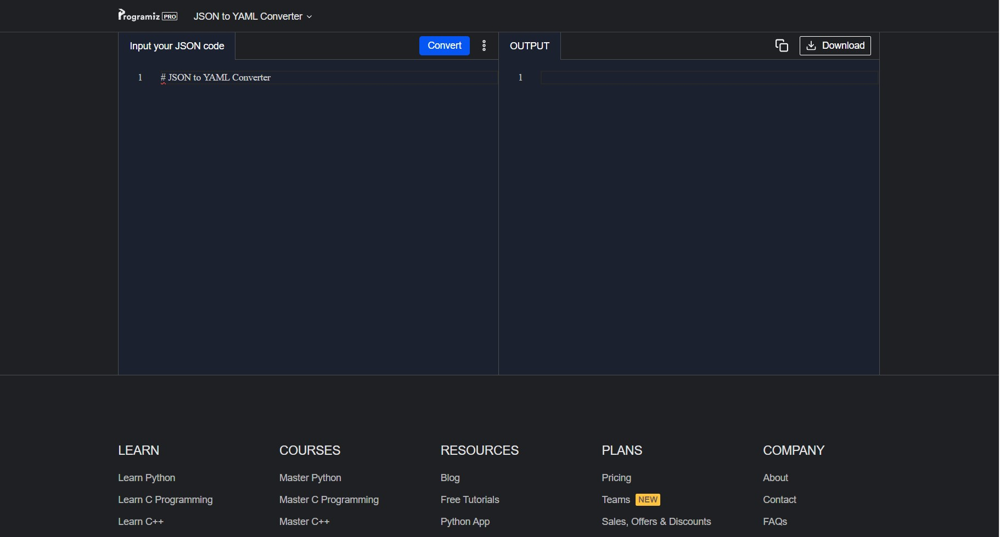

# Utility Tools

Utility tools are the various tools like JSON to YAML etc. This porject is made with htmx, node and express and pug as a views.

### HTMX

HTMX is the HTML extension syntax that replaces Javascript with simple markup. It is used to send requests to the server without the need of API's and can send request directly and send HTML as a response. In this project I have made a express server in MVC architecture to build various utility tools that can be used while coding. Some of the features this project consists are:

1. JSON TO YAML Converter
2. YAML TO JSON Converter
3. JSON TO STRING Converter
4. STRING TO JSON Converter
5. JSON Formatter
6. YAML Formatter

I used [Monaco Editor](https://microsoft.github.io/monaco-editor/) as the editor for this project. Since [HTMX](https://htmx.org/) gives HTML in response, I sent the editor as response when the conversion was complete. THough one drawback of using HTMX for these kinds of projects were that it complicated the process as most of the things were done in the fornt-end while HTMX specializes in sending requests. HTMX can be used for other usecases where a lot of request needs to be sent or simpke a back-end developer can make a simple app fast and easily.

### Usage

Put the respective code in the input code editor and press the CTA button and get the result in the output editor.

### Setting Up Locally

Install the dependencies

```
npm install
```

Run the server

```
npm run dev
```

### Screenshot


